## 🎮 Game Codex API

API RESTful focada na busca, consulta e descobrimento de jogos digitais, desenvolvida utilizando Express.js, TypeScript, Prisma ORM e PostgreSQL.

A Game Codex API simula uma biblioteca de jogos semelhante a plataformas como Steam e IGDB, permitindo explorar jogos através de múltiplos filtros.

### ⚙️ Funcionalidades

Além das funcionalidades de `CRUD` básicas para jogos e estudios de desenvolvimento, A API possui recursos de pesquisa e descoberta de jogos por:

- ✏️ Nome
- 🎮 Gênero
- 💻 Plataforma
- 🕹️ Tipo de plataforma
- 🏢 Estúdio
- 🎯 Classificação indicativa
- 📅 Data de lançamento

Além disso, a aplicação foi projetada com foco em:

- 🏗️ Arquitetura em camadas
- 📦 Organização modular
- 🔄 Modelagem relacional
- ✅ Validação de dados
- 🎯 Boas práticas de desenvolvimento backend

### 🔎 Exemplos de Pesquisa

#### Buscar jogos por nome:

```bash
GET /games?name=elden-ring
```

#### Filtrar por gênero:

```bash
GET /games?genre=rpg
```

#### Filtrar por plataforma:

```bash
GET /games?platform=pc
```

#### Filtrar por tipo de plataforma

```bash
GET /games?type=CONSOLE
```

#### Filtrar por estúdio

```bash
GET /games?studio=from-software
```

#### Filtrar por classificação indicativa

```bash
GET /games?classification=18
```

#### Filtrar por data de lançamento

```bash
GET /games?releaseDate=2022-02-25
```

#### Combinar múltiplos filtros

```bash
GET /games?genre=rpg&platform=pc&classification=18
```

### 📁 Estrutura de Pasta

```bash
src/
├── app.ts
├── server.ts
│
├── routes/
├── middlewares/
├── utils/
├── lib/
├── generated/
│
└── modules/
    ├── game/
    ├── genre/
    ├── platform/
    ├── gameStudio/
    └── country/
```

### 🗃️ Documentação

#### Arquitetura em Camadas



#### Modelagem de Dados


### 🎯 Objetivo do Projeto

O objetivo da **Game Codex API** é demonstrar a construção de uma **API backend moderna e organizada**, aplicando conceitos amplamente utilizados no mercado como:

- APIs REST
- Arquitetura em camadas
- Query params dinâmicos
- Validações de payloads com Zod
- Persistência de dados com PostgreSQL
- ORM com Prisma

### 🚀 Tecnologias Utilizadas


